# prog_c_001

## El programa (Código Fuente)

Tenemos aquí un primer programa, muy sencillo, que nos muestra el texto **"hola mundo"** en una linea y después la suma de dos variables. 

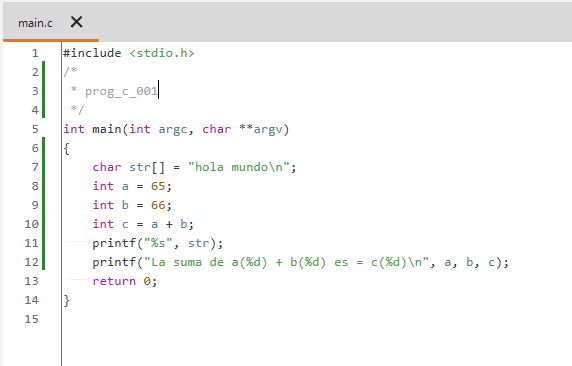 

Para ello definimos un array de caracteres con el texto **"hola mundo"**, después dos enteros que inicializamos con unos valores arbitrarios y un tercer entero con la suma de los dos anteriores.

Seguidamente mostramos por pantalla el texto y los valores.

Compilamos y vemos el resultado que nos muestra ...

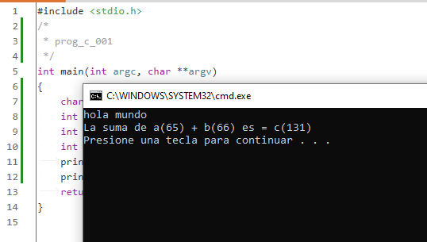 

En el análisis de este programa me voy a detener con mas detalle en algunos pasos previos, que en posteriores análisis omitiré. El objetivo es ver donde se sitúa exactamente la función **main()** del programa.

## Análisis estático con Ghidra

Veamos que nos muestra **Ghidra**:

### Entry point

Si buscamos el **"entry"** (punto de entrada) vemos que nos lleva a **_mainCRTStartup** que establece el tipo de aplicación con **__set_app_type()** según sea de Consola (**CLI**) o ventanas de Windows (**GUI**) y a continuación llama a la función **FUN_004011a0**.

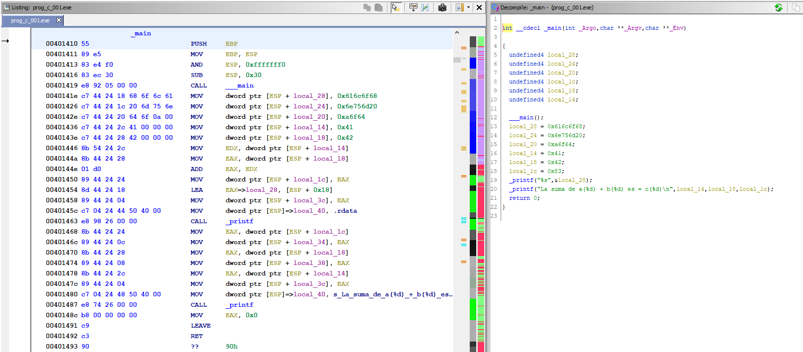

Dentro de esta función, no vamos a profundizar en todas las instrucciones que ejecuta, pero si podremos identificar la función **main()** que nos interesa. Es el **_main()** que recibe como parámetros los argumentos de la linea de comandos (aunque no los usemos en el programa), y al finalizar esta función se ejecutan las funciones de salida del programa, **__cexit()** y **_ExitProcess@4**.

 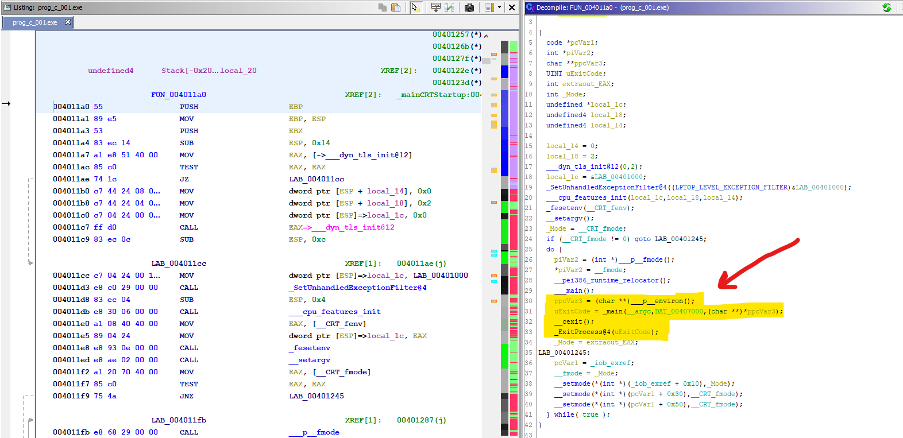

Detalle de la llamada a **_main()**

 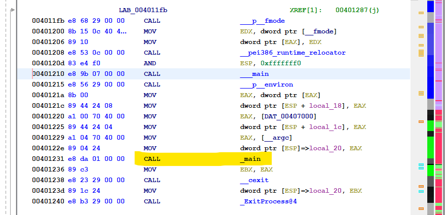
 
Si hacemos **doble click** o pulsamos **enter** sobre **_main()** entraremos en la función y veremos que nos muestra Ghidra. 

### main()

Podemos comprobar que el Descompilado se acerca bastante a nuestro código original. A partir de este punto tratare de vincular el fuente en C con las diferentes partes en assembler para identificar los diferentes bloques de código que genera el compilador.
 
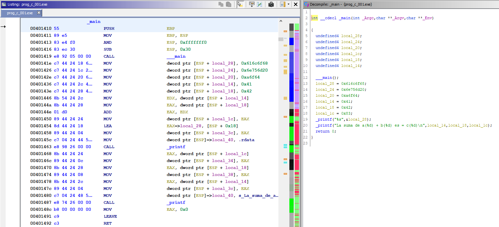
  
Aquí vemos en el lado izquierdo el código original y en el derecho la reconstrucción hecha por Ghidra.
  
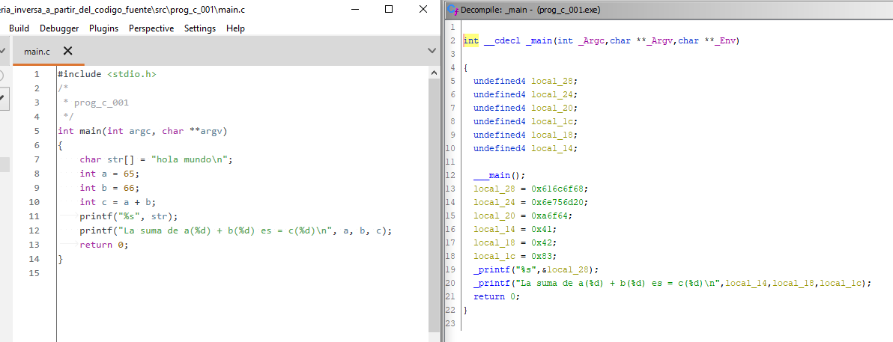

El primer paso será renombrar las diferentes variables generadas por Ghidra y veremos si nos crea alguna de más en la interpretación del código assembler.

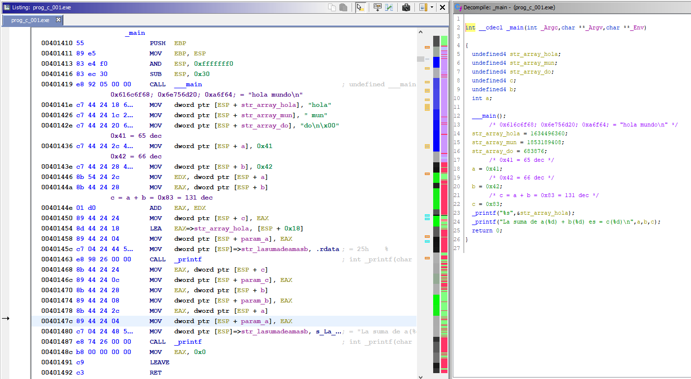

La primera cosa curiosa es que la cadena **"hola mundo\n"** la divide en tres movimientos con valores hexadecimales que corresponden a 3 partes de la cadena: "hola", " mun", "do\n\null", que curiosamente son 4 caracteres cada grupo. Es decir, tres numeros de 32 bits. 

Después se puede identificar como asigna los valores de las variables **a** y **b**, seguidamente las suma y asigna el valor a **c**, aunque en el descompilado no se refleja esta suma, sino que se pone directamente el valor final. 

Tras hacer las operaciones, vemos como prepara el paso de parámetros para imprimir el texto, pasando únicamente la dirección del inicio de la cadena "hola mundo", la variable **str_array_hola**.

Después de llamar a la función **_printf()** procede a mover los valores de las variables **c**, **b** y **a**, a las respectivas posiciones de la pila para pasarlas como parámetro, así como el texto con formato que precede a estas variables, y finalmente llama de nuevo a la función **_printf()**.

Cabe notar que en el renombrado de las variables en el apartado del descompilado (zona derecha de la pantalla), no he finalizado la especificación del tipo de cada variable. Nótese que pone **undefined** en todas las variables excepto en una que he podido indicar como **int**. Parece ser algún problema del descompilador de Ghidra, pues al cambiar el tipo hacía desaparecer algunas variables del código y he optado por no especificar el tipo.

### Almacenamiento de variables

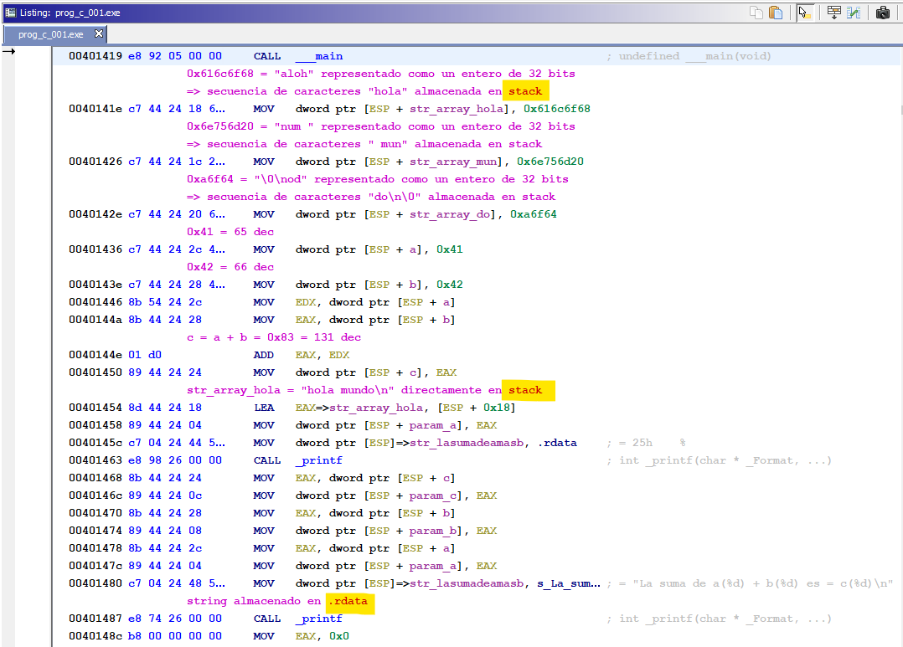

Volviendo a las variables y las cadenas de texto, podemos observar 2 diferencias.

En el caso de la cadena "hola mundo\n", tal y como se detalla en la imagen anterior, la divide en tres números de 32 bits para volcarlos en la pila y pasar luego la dirección de memoria del inicio de la cadena.

Lo mismo pasa con los valores de **a**, **b** y **c** en los que carga los valores directamente en la pila, o el valor del registro resultado de la suma en el caso de **c**.

No hace lo mismo para la cadena **"la suma de a(%d)...."** que esta definida en la sección **.rdata** es la única cadena de texto que encuentra si hacemos una búsqueda de strings.

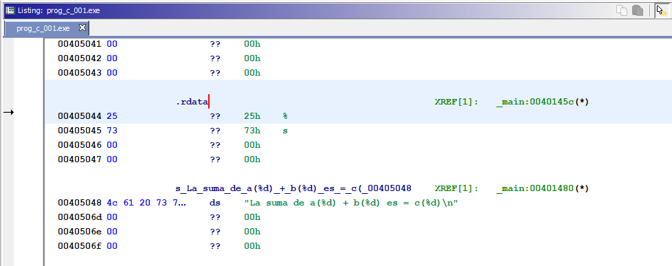

## Análisis estático con Cutter

Cargamos ahora el mismo programa con **Cutter** y veremos si se aprecia alguna diferencia.

De entrada el desensamblado nos ofrece mas información en cada opcode de ensamblador que en el caso de Ghidra (es probable que Ghidra también lo haga y yo no lo haya sabido ver y activar). Aqui directamente vemos que los valores hexadecimales cargados sobre la pila corresponden al texto "hola mundo\n" gracias a estos comentarios de cada linea.

El descompilado es similar, casi exacto, excepto por el nombre de las variables, al que nos ofrece Ghidra. Esto es debido a que usa el mismo motor.

### main()

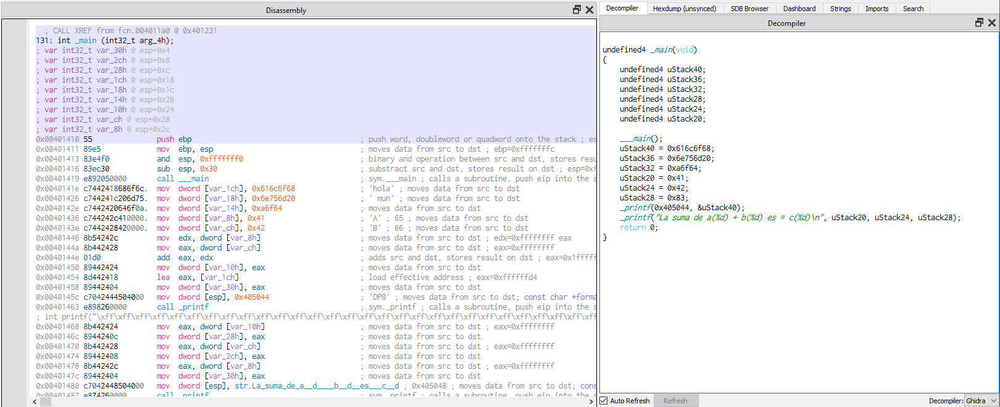

Si utilizamos el motor de descompilado original de radare, **r2dec** el código se muestra muy diferente, con muchos mas movimientos y asignaciones en variables dificultando algo más su comprensión.

### Descompilado nativo

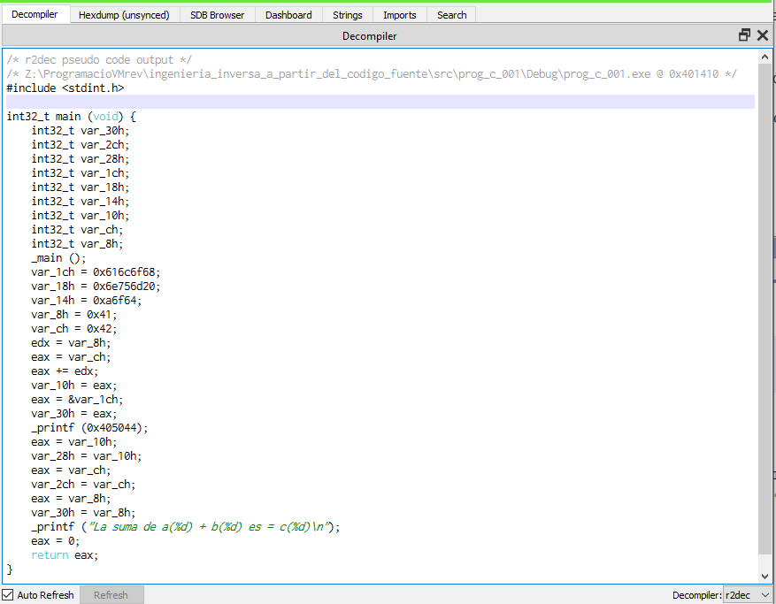

Seguimos con el descompilado del motor de Ghidra y pasamos a renombrar las variables. Y podemos observar como el cambio en el desensamblado se refleja en el descompilado cuando se usa el motor nativo de radare, es decir, **r2dec**.

### Renombrado de variables

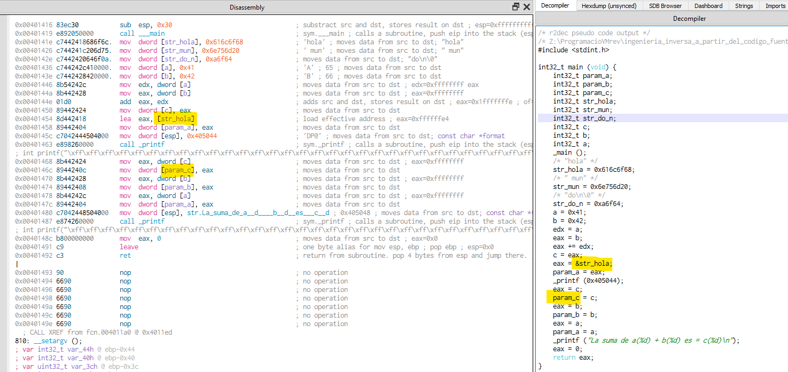

En cambio, usando el motor de Ghidra vemos que los comentarios si se trasladan, pero el renombrado de variables no es efectivo, por lo que en lugar de ayudar puede dificultar su seguimiento en caso de un programa o función complejos.

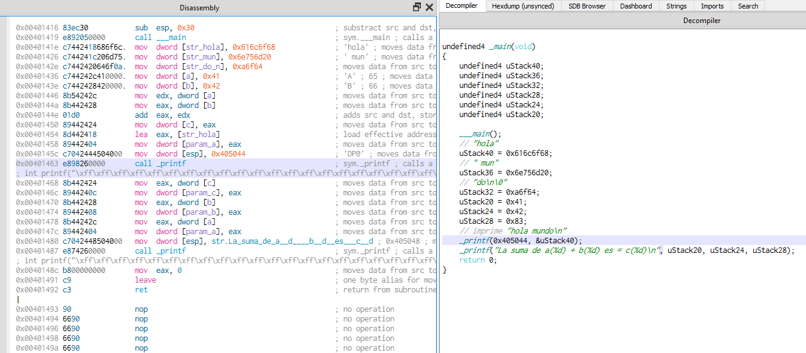

### Tipos de variables

En lo que a la definición y tipos de variables parece mas limpio con Cutter que con Ghidra una vez trasladado al codigo ensamblador. 

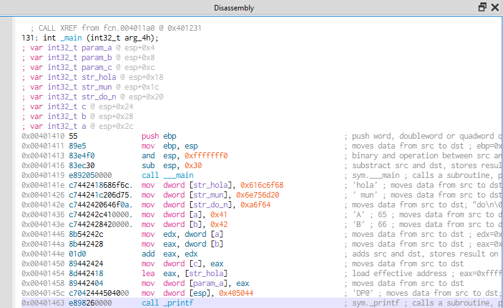

### fin prog_c_001

[**SIGUIENTE** prog_c_002 ==>>](../prog_c_002/prog_c_002.md)
