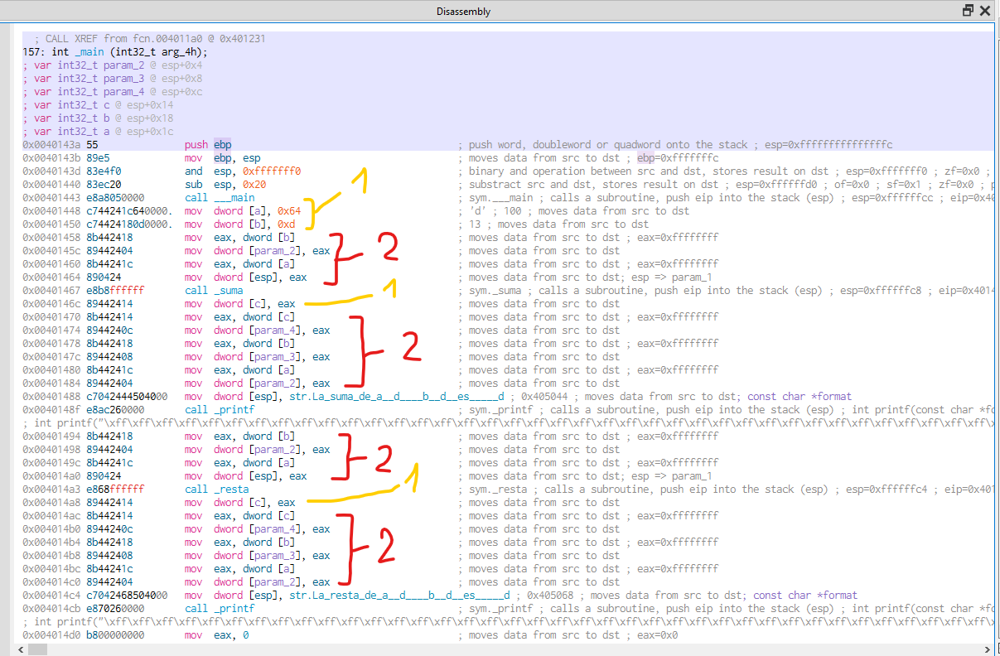
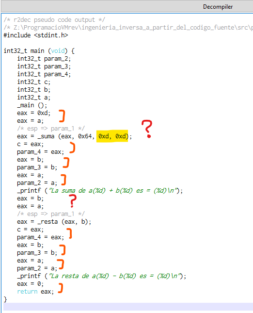
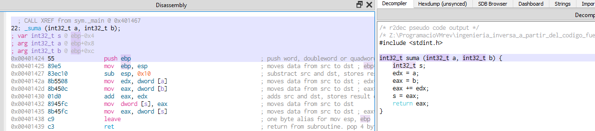
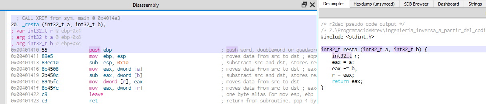

# prog_c_002

## El programa (Código Fuente)

Con este segundo programa introducimos las llamadas a las funciones, y creamos dos sencillas funciones. Una que devuelve la suma de dos enteros, y otra que devuelve la resta de un entero sobre otro.

Tras devolver los resultados se muestran por pantalla desde la función **main()**

 

Aqui vemos el resultado de la ejecución.

 

## Análisis estático con Ghidra

Pasamos a ver el código en **Ghidra**:

### Entry point

El formato del **entry point** no varia, y es exactamente igual que el del ejemplo anterior.

No entraré en mas detalles. Simplemente mostrar la imagen de ejemplo.

La siguiente función en la dirección **004011a0** también tiene el mismo código. Las mismas inicializaciones y llamadas a funciones, recogida de variables de entorno, argumentos y llamada a la función **main()** de nuestro código en C.

 

Y entramos en la función **_main()** donde podemos ver en el Descompilado la estructura de nuestro código original en C. Incluso los mismos nombres de las dos funciones que hemos creado, con la salvedad de que van precedidas por un guión bajo. Eso es así por que se ha establecido la opción **debug** en el compilador que incluye los nombres de los símbolos. 

 
 

### Variables desaparecidas?

Si comparamos el descompilado con el codigo fuente original vemos que las variables **a** y **b** no aparecen inicializadas, sino que se ponen directamente los valores como parámetros de las funciones. Esto, en algunos casos, puede ser debido a las optimizaciones del compilador, pero en este caso es una optimización generada por el descompilador de Ghidra. También podría ser diferente si se usara otro compilador de **lenguaje C** aunque el fuente sea exactamente el mismo.

  
Aquí la sustitución de variables en la parte descompilada es rápida, aunque en la parte del código de ensamblador veremos que hay muchos movimientos que pasamos a observar.

### Parámetros 

Podemos ver como carga los valores de las variables **a** y **b** en la pila, para después volverlos a cargar en el registro **EAX** para situarlos de nuevo en la pila en las posiciones de cada uno de los parámetros a pasar en la llamada a la función **_suma()**. Justo al finalizar la llamada a la función se carga el resultado que esta en el registro **EAX** sobre la zona de la pila correspondiente a la variable **c**.
  

En la llamada a la función de impresión por pantalla (**_printf**) hace exactamente lo mismo. En este caso son 4 parámetros. Empieza cargando el cuarto parámetro (contando de izquierda a derecha), el cual es el resultado de la suma, es decir, la variable **c** representada en el descompilado como **EAX**. Después la variable **b**, la **a**, y por último el texto con el formato que lo obtiene de la sección **.rdata**.

### Sección de Datos

Aquí podemos ver la sección **.rdata** con el texto con el formato de la impresión.

### Funciones

Pasemos a ver las llamadas a las funciones y ver las operaciones que se hacen.

En el caso de la **suma** podemos observar como Ghidra a simplificado nuestra función original, donde hemos usado una variable temporal expresamente, la variable **s** para almacenar la suma de los dos parámetros y después devolver el resultado.

Si analizamos la parte de código en ensamblador, equiparando con el código original podremos ver las siguientes partes:

* Código inicial que salva el estado de la pila (en amarillo).
* Carga primer parámetro (morado).
* Carga segundo parámetro (rojo).
* Efectua la suma (verde).
* Asigna resultado a variable **s** (azul).

El caso de la **resta** es muy similar al de la suma. En la imagen, se puede ver, aunque he omitido lineas de colores por que creo que es evidente cada paso con los comentarios.

## Análisis estático con Cutter

Cargamos ahora el mismo programa con **Cutter** y veremos si se aprecia alguna diferencia.

A partir de este programa usaré por defecto el compilador nativo de **radare2**, el **r2dec** ya que ya hemos visto que usando el motor de Ghidra el descompilado es similar, pero nos limita el renombrado de variables.

### Entry Point

El punto de entrada se descompila de manera similar y no nos ofrece nada nuevo.

La función **fcn.004011a0** también nos muestra claramente la llamada a la función **_main()** que es en la que nos centraremos a partir de ahora en los siguientes programas.

### Main

Aqui tenemos la función **main** antes de renombrar algunas variables, donde se puede apreciar bastante la mezcla de nomenclatura assembler con el C.

### Original vs descompilado

Pongamos de lado el codigo fuente original con el descompilado.

Así, en un primera vista rápida, podemos identificar las variables **a**, **b**, y **c**.

### Renombrado de variables

Vayamos a renombrar estas variables para ver que movimientos hace.

Podemos identificar en los grupos numerados con 1 (en amarillo) como se asignan los valores inciales a las variables, y los resultados de las llamadas a las funciones.

Y en los grupos numerados con 2 (en rojo) como se asignan los valores a los diferentes parámetros que recibirán las funciones.

Aún así, el descompilado queda algo confuso, con movimientos entre variables y registros que se podrian simplificar en algun caso, o que son incongruentes en otros. De la misma manera que interpreta la llamada a la función de la **suma()** con cuatro parámetros en lugar de dos.

### Funciones

En el caso de la **suma**, al ser una función muy corta quedan bastante claros los pasos y las respectivas variables, aunque en el descompilado usa los registros **edx** y **eax** para representar la operación de la suma en lugar de las variables.

Y con la **resta** el caso es similar a la suma pero claramente comprensible la operación.

### fin prog_c_002

[<<== **ANTERIOR** prog_c_001](../prog_c_001/prog_c_001.md)
