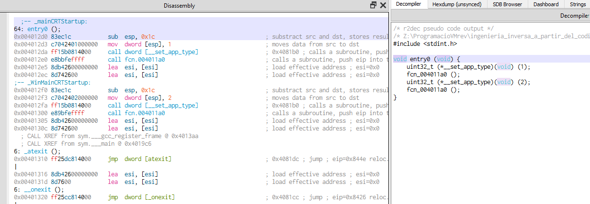

# prog_c_002

## El programa (Código Fuente)

Con este segundo programa introducimos las llamadas a las funciones, y creamos dos sencillas funciones. Una que devuelve la suma de dos enteros, y otra que devuelve la resta de un entero sobre otro.

Tras devolver los resultados se muestran por pantalla desde la función **main()**

 

Aqui vemos el resultado de la ejecución.

 

## Análisis estático con Ghidra

Pasamos a ver el código en **Ghidra**:

### Entry point

El formato del **entry point** no varia, y es exactamente igual que el del ejemplo anterior.

No entraré en mas detalles. Simplemente mostrar la imagen de ejemplo.

La siguiente función en la dirección **004011a0** también tiene el mismo código. Las mismas inicializaciones y llamadas a funciones, recogida de variables de entorno, argumentos y llamada a la función **main()** de nuestro código en C.

 

Y entramos en la función **_main()** donde podemos ver en el Descompilado la estructura de nuestro código original en C. Incluso los mismos nombres de las dos funciones que hemos creado, con la salvedad de que van precedidas por un guión bajo. Eso es así por que se ha establecido la opción **debug** en el compilador que incluye los nombres de los símbolos. 

 
 

### Variables desaparecidas

Si comparamos el descompilado con el codigo fuente original vemos que las variables **a** y **b** no aparecen inicializadas, sino que se ponen directamente los valores como parámetros de las funciones. Esto puede ser debido a las optimizaciones del compilador, o incluso la propia interpretación del descompilador de Ghidra. También podría ser diferente si se usara otro compilador de **lenguaje C** aunque el fuente sea exactamente el mismo.

  
Aquí la sustitucion de variables en la parte descompilada es rápida, aunque en la parte del codigo de ensamblador veremos que hay muchos movimientos que pasamos a observar.
  

El primer paso será renombrar las diferentes variables generadas por Ghidra y veremos si nos crea alguna de más en la interpretación del código assembler.

La primera cosa curiosa es que la cadena **"hola mundo\n"** la divide en tres movimientos con valores hexadecimales que corresponden a 3 partes de la cadena: "hola", " mun", "do\n\null", que curiosamente son 4 caracteres cada grupo. Es decir, tres numeros de 32 bits. 

Después se puede identificar como asigna los valores de las variables **a** y **b**, seguidamente las suma y asigna el valor a **c**, aunque en el descompilado no se refleja esta suma, sino que se pone directamente el valor final. 

Tras hacer las operaciones, vemos como prepara el paso de parámetros para imprimir el texto, pasando únicamente la dirección del inicio de la cadena "hola mundo", la variable **str_array_hola**.

Después de llamar a la función **_printf()** procede a mover los valores de las variables **c**, **b** y **a**, a las respectivas posiciones de la pila para pasarlas como parámetro, así como el texto con formato que precede a estas variables, y finalmente llama de nuevo a la función **_printf()**.

Cabe notar que en el renombrado de las variables en el apartado del descompilado (zona derecha de la pantalla), no he finalizado la especificación del tipo de cada variable. Nótese que pone **undefined** en todas las variables excepto en una que he podido indicar como **int**. Parece ser algún problema del descompilador de Ghidra, pues al cambiar el tipo hacía desaparecer algunas variables del código y he optado por no especificar el tipo.

### Almacenamiento de variables

Volviendo a las variables y las cadenas de texto, podemos observar 2 diferencias.

En el caso de la cadena "hola mundo\n", tal y como se detalla en la imagen anterior, la divide en tres números de 32 bits para volcarlos en la pila y pasar luego la dirección de memoria del inicio de la cadena.

Lo mismo pasa con los valores de **a**, **b** y **c** en los que carga los valores directamente en la pila, o el valor del registro resultado de la suma en el caso de **c**.

No hace lo mismo para la cadena **"la suma de a(%d)...."** que esta definida en la sección **.rdata** es la única cadena de texto que encuentra si hacemos una búsqueda de strings.

## Análisis estático con Cutter

Cargamos ahora el mismo programa con **Cutter** y veremos si se aprecia alguna diferencia.

De entrada el desensamblado nos ofrece mas información en cada opcode de ensamblador que en el caso de Ghidra (es probable que Ghidra también lo haga y yo no lo haya sabido ver y activar). Aqui directamente vemos que los valores hexadecimales cargados sobre la pila corresponden al texto "hola mundo\n" gracias a estos comentarios de cada linea.

El descompilado es similar, casi exacto, excepto por el nombre de las variables, al que nos ofrece Ghidra. Esto es debido a que usa el mismo motor.

### main()

Si utilizamos el motor de descompilado original de radare, **r2dec** el código se muestra muy diferente, con muchos mas movimientos y asignaciones en variables dificultando algo más su comprensión.

### Descompilado nativo

Seguimos con el descompilado del motor de Ghidra y pasamos a renombrar las variables. Y podemos observar como el cambio en el desensamblado se refleja en el descompilado cuando se usa el motor nativo de radare, es decir, **r2dec**.

### Renombrado de variables

En cambio, usando el motor de Ghidra vemos que los comentarios si se trasladan, pero el renombrado de variables no es efectivo, por lo que en lugar de ayudar puede dificultar su seguimiento en caso de un programa o función complejos.

### Tipos de variables

En lo que a la definición y tipos de variables parece mas limpio con Cutter que con Ghidra una vez trasladado al codigo ensamblador. 

### fin prog_c_001

