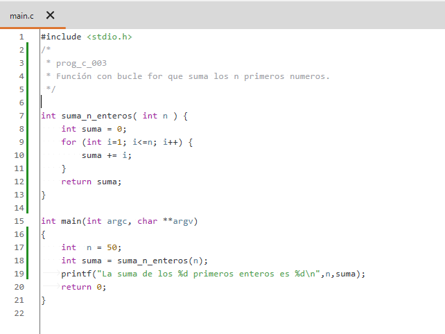
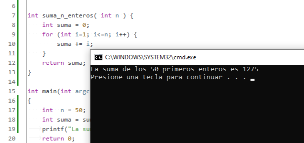
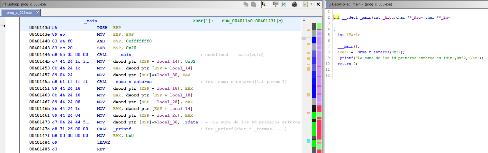
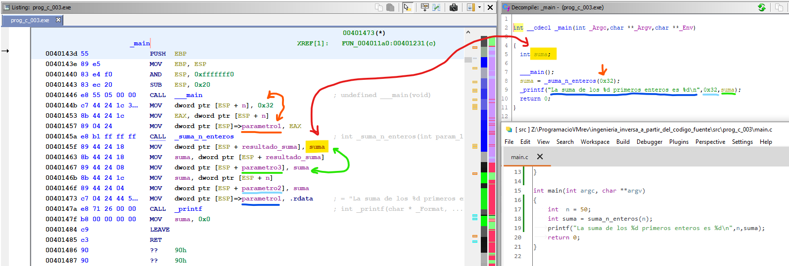
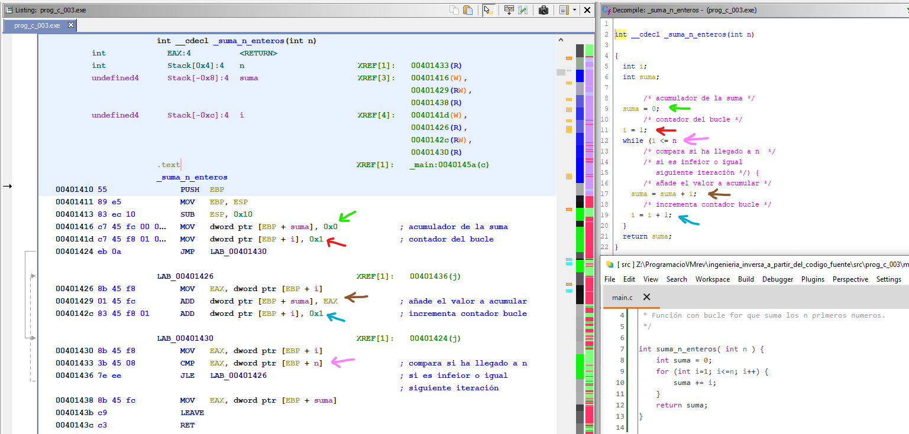
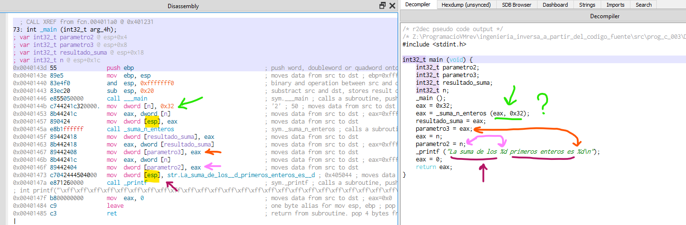
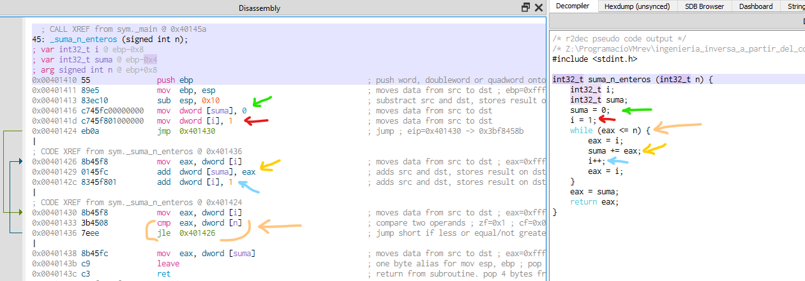

# prog_c_003

## El programa (Código Fuente)

En este caso vamos a hacer una función que sume los primeros **"n"** números pasados como parámetro y nos devuelva el resultado de esta suma.

Para ello usaremos un bucle **for** para ver como lo implementa en ensamblador.

 

Aquí vemos el resultado de la ejecución.

 

## Análisis estático con Ghidra

Pasamos a ver el código en **Ghidra**:

### Main

Iremos directamente a la función **main()** a ver que nos encontramos.

El primer paso, como siempre, vamos a renombrar algunas variables para identificarlas mejor.

En el descompilado de Ghidra, como es habitual, simplifica el código y solo crea la variable que guarda el resultado de la suma, y la variable **n** no la crea, sinó que pone directamente el valor como parámetro de la función. 

Esta diferencia se ve reflejada en el código en ensamblador donde se ve la creación de la variable **n** y posteriormente el movimiento a la pila donde se pasa como parámetro (indicado en color naranja).

### Suma n enteros

Pasamos a ver ahora la función de la suma, pero mostraré directamente las funciones con las variables renombradas, pues llegados a este punto creo que ya se entiende el procedimiento.

Podemos comprobar que Ghidra no ha hecho un bucle **for**, sino lo ha convertido en un **while**, aunque ya sabemos que en ensamblador todos los bucles serán iguales por que serán todos compuestos por una comparación **CMP** seguida de un salto condicional, **JLE** en este caso. 
 

## Análisis estático con Cutter

### Main

Podemos observar como crea la variable **n** asignando el valor **0x32** (50 decimal) y como luego lo carga en la pila con **mov dword[esp],eax** (marcado en amarillo).

El descompilado aparentemente comete un error por que nos muestra la llamada a la función **suma_n_enteros()** pasando 2 parámetros cuando en realidad solo es uno (señalado en verde).

Después en el **printf()** previamente pasa 3 parámetros, el primero es la cadena de formato, el segundo es la variable **n**, y el tercero el resultado de la suma representado en el código con el registro **eax**, que previamente asigna a la variable **resultado_suma** pero que no se usa en el descompilado.

### Suma n enteros

La función de suma se muestra con un descompilado similar al que nos ofrece Ghidra; también usa un bucle **while**, aunque sigue fallando en la simplificación de variables y añade operaciones mostrando el registro **eax**.

En la parte del listado en ensamblador la diferencia frente a Ghidra es que las operaciones con variables son directamente con los nombres asignados, mostrando arriba la tabla de posiciones en la Pila, mientras que Ghidra nos muestra siempre un **EBP + variable**

En el caso de los saltos usa siempre direcciones de memoria, frente a las etiquetas de Ghidra.

### fin prog_c_003

[<<== **ANTERIOR** prog_c_002](../prog_c_002/prog_c_002.md)

[**SIGUIENTE** prog_c_004 ==>>](../prog_c_004/prog_c_004.md)
