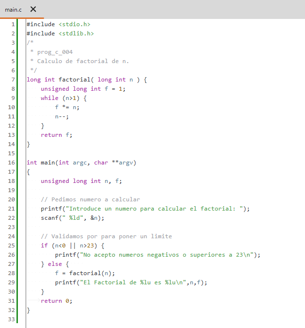
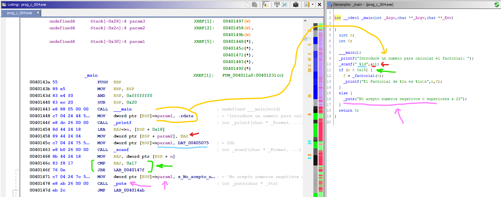

# prog_c_004

## El programa (Código Fuente)

Vamos a calcular el **Factorial** de un número y analizaremos el código generado.

Si no sabes el factorial de un entero, te remito a la [Wikipedia](https://es.wikipedia.org/wiki/Factorial)

Como se trata solo de analizar el código generado en ensamblador e interpretar las operaciones, y no es el caso de hacer grandes cálculos, nos limitaremos al tamaño de un entero largo.

Aquí introducimos también nuevas librerías y una entrada de datos si entrar en detalles profundos en la validación de datos. Simplemente no dejaremos que el usuario entre valores por debajo o encima de los aceptados.

 

Aquí vemos el resultado de la ejecución.

 

## Análisis estático con Ghidra

### Main

Analizando el **main()** veamos que novedades encontramos una vez cambiados los nombres autómaticos de las variables por los nuestros.

Entraré ahora en un detalle que no he comentado en los análisis anteriores, y es en el espacio usado en la pila. Al principio de la función **main()** aparece arriba la definición de diferentes variables y su posición en la pila. Aquí podremos ver que estas posiciones que se cargan justo antes de las llamadas a las funciones son los parámetros que se pasan a estas, y que estas posiciones se reaprovechan de una función a otra, por lo que una vez identificadas se pueden renombrar como **parametro1**, **parametro2**, **parametro3**, etc...

***NOTA:*** Posteriormente he añadido un **anexo** en el primer análisis, el de [**prog_c_001**](../prog_c_001/prog_c_001.md) donde hago mención a la convención de paso de parámetros **__cdecl**.

Como ejemplo, en el caso de la llamada al primer **printf**, como se carga como parámetro el texto que se muestra, y en este caso lo carga desde la sección de de datos **.rdata** (señalizado en amarillo).

Algo similar pasa con la función **scanf()** que recibe dos parámetros. El segundo es la dirección de memoria de la variable donde va a almacenar el numero que se solicita, y el primer parámetro es el formato del contenido que se va a entrar (señalizado en rojo y celeste).

Donde se aprecia una diferencia con el código original es en el **if** que teníamos con un **or** comparando con menor de 0 y mayor de 23 y aquí se ha simplificado en el código en ensamblador con un **CMP EAX, 0x17**, es decir, compara con 23 y si el resultado es menor o igual salta a la parte de código que llamará a la función.

En la traducción del descompilado no es exactamente igual, pues lo traduce por un **if** comparando con **0x18** (24 dec), nótese esta diferencia (señalizado en verde).

Y otra curiosidad, y esto si es una optimización del compilador. Se ha sustituido el **printf** del mensaje de error, por un **puts** puesto que es un texto simple y no recibe ninguna cadena con formato ni variables adicionales (señalizado en rosa/morado).

Ya centrándonos en la llamada a la función **factorial** podemos ver donde se carga el parámetro a pasar a la función (señalizado en verde), para luego recibir el resultado sobre el mismo registro **EAX**.

Y para acabar carga los parámetros para la función **printf** con el resultado, siendo el **parámetro1** la cadena con el formato (en rojo), el **parámetro2** el número a calcular el factorial (en naranja), y el **parámetro3** el factorial calculado (en azul).

### Factorial

El la función principal de este programa podemos ver que el código en **C** generado es casi exacto al original. Podemos ver que las variables las declara como **int** en lugar de **long int** como está en el código original, por que en realidad el código en ensamblador lo sigue tratando con 32 bits.

Se identifica sin problema la inicialización de la variable **f** que devuelve el factorial, el parametro **n**, que es el numero del que se desea el factorial, y es el contador del bucle, y la condición de control del bucle.

## Análisis estático con Cutter

### Main

Aquí **Cutter** nos ofrece en el Descompilado una estructura mas parecida al código ensamblador haciendo la comparación con el valor **0x17** (23 dec), también se aprecia sin problema la creación de variables y paso de parámetros, aunque el descompilador falla en este aspecto, pues en el último **printf** (señalado en rojo y con interrogante) pone el texto con la cadena de formato, pero no se incluyen las variables **n** y **f** que estan representadas por **param_n** y **param_f**.

### Factorial

Ninguna novedad respecto a partes anteriores del análisis puesto que el ensamblador queda claro, y en la parte de descompilado adolece por la representación del uso de los registros del procesador, que si sabemos abstraer mentalmente nos quedan claras las operaciones del programa.

### fin prog_c_004

[<<== **ANTERIOR** prog_c_003](../prog_c_003/prog_c_003.md)

[**SIGUIENTE** prog_vp_001 ==>>](../prog_vp_001/prog_vp_001.md)
