# prog_vp_001

Empiezo con este programa, la serie de análisis con aplicaciones hechas en Free Pascal / Object Pascal y compiladas con [Lazarus](https://www.lazarus-ide.org/).

## El programa (Código Fuente)

Partiré de un programa similar, sino igual, al primero que hice en C, [**prog_c_001**](../prog_c_001/prog_c_001.md), donde se muestra el texto **"hola mundo"** por pantalla y después la suma de dos variables.

El programa, al igual que los anteriores, es de consola, sin entorno gráfico.

Aquí tenemos el código fuente:
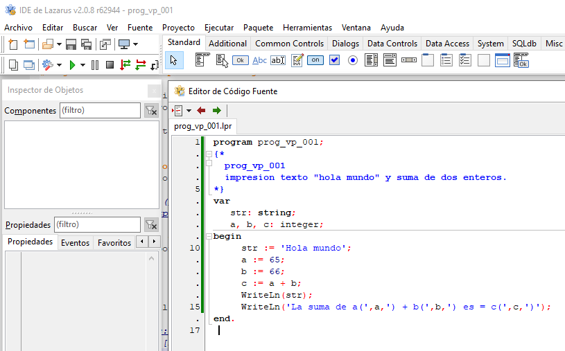 

Y aquí vemos el resultado de la ejecución.
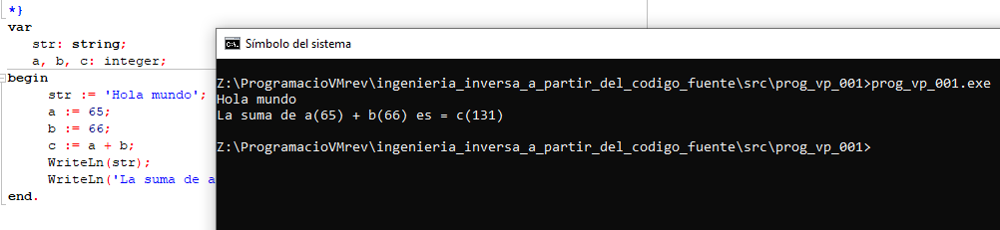 

## Análisis estático con Ghidra

Remarcar que este ejecutable se ha compilado por defecto para **64 bits**, y el identificador de Compilador de Ghidra nos indica **visualstudio:unknown** igual que en los programas anteriores compilados con **MinGW**.

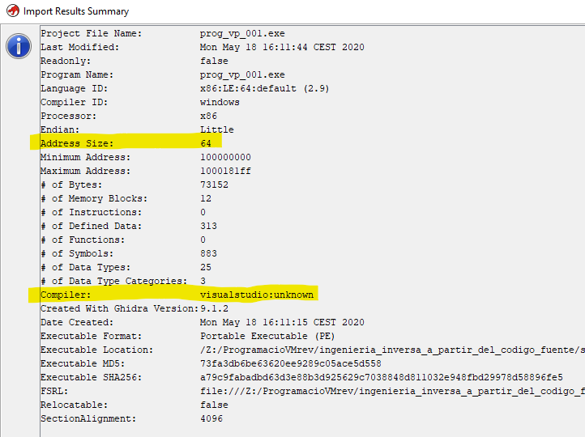

### Main

Si buscamos la función **main()** veremos algunas diferencias con respecto a los programas compilados con **MinGW**.

El primer cambio significativo es que la llamada a las funciones es **__fastcall** (señalado en rojo). Que significa esto?

La convención de llamada, conocida también por **__msfastcall** pues es utilizada por muchos compiladores de [***Microsoft***](https://docs.microsoft.com/en-us/cpp/cpp/fastcall?view=vs-2019), dice que se utilizará siempre que se pueda los registros **ECX** y **EDX** (**RDX**) para el paso de los dos primeros argumentos (señalado en naranja), *de izquierda a derecha*, y el resto de argumentos se colocaran en la **pila** de *derecha a izquierda* (señalado en amarillo).

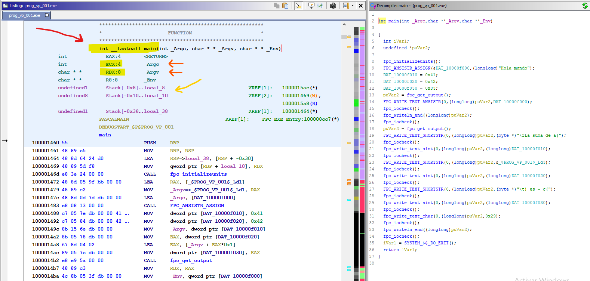

También podemos evidenciar que el programa esta hecho con **Free Pascal** por la indicación al inicio en el listado del desensamblado y las múltiples referencias a funciones con el prefijo **FPC_**.

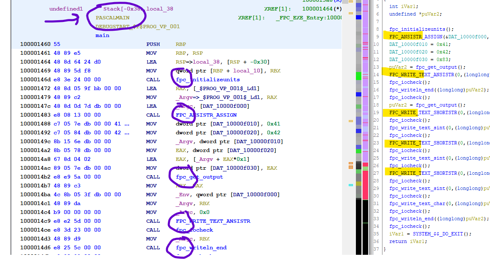

### Variables y datos preinicializados

Podemos observar otra diferencia respecto a **MinGW**, donde las variables se almacenaban en la Pila, y en este caso tienen su espacio en la sección de datos **.bss** la cual es una sección de datos no inicializados.

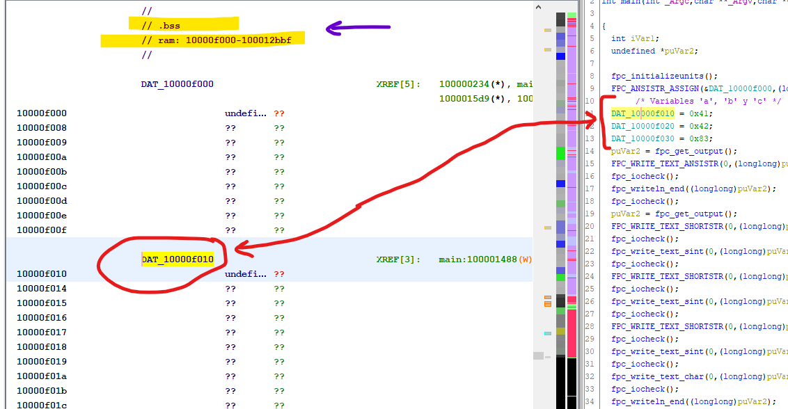

En la sección **.rdata** encontramos el texto **"hola mundo"** y el resto de fragmentos de texto que usamos para mostrar el resultado de la suma de las variables.

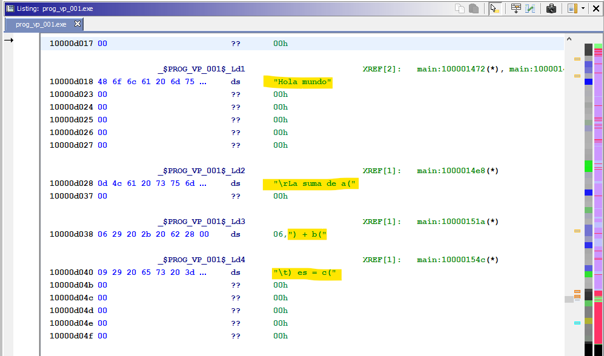

### Renombrado de variables y cálculo

Tenemos finalmente un código en ensamblador muy diferente al visto en [**prog_c_001**](../prog_c_001/prog_c_001.md) a pesar de mostrar exactamente el mismo texto y hacer las mismas operaciones, y teniendo una estructura de programa en el fuente original casi exactas, con la excepción de usar diferentes lenguajes y diferentes compiladores, como es obvio. 

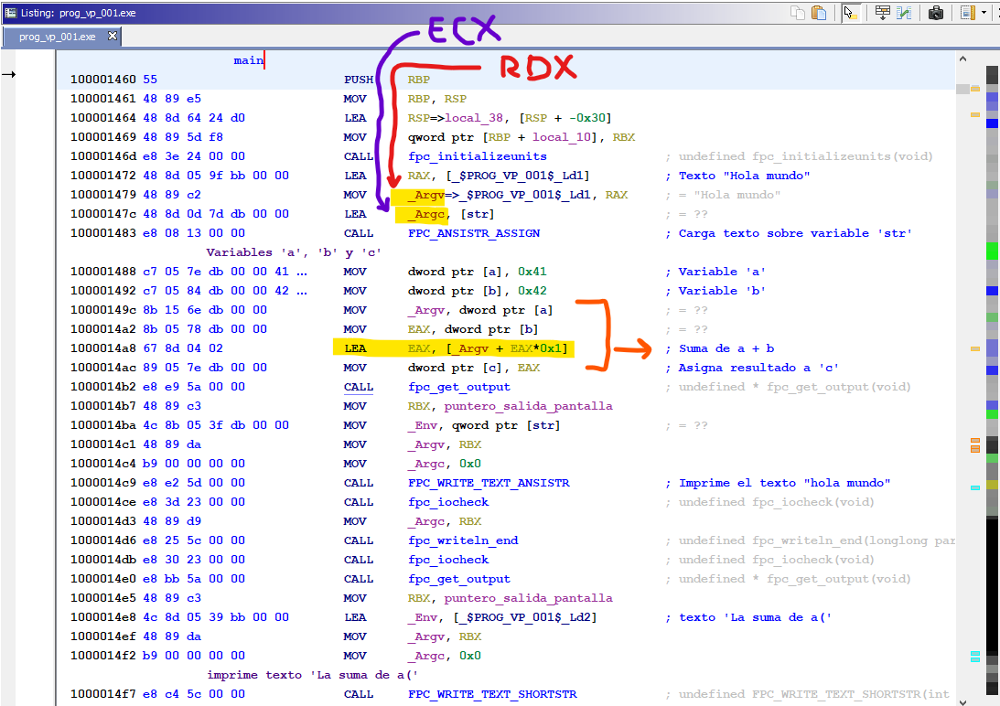

Para empezar, veremos al inicio del **main** que hace referencia a **_Argv** y **_Argc** pero en realidad es una interpretación de **Ghidra** al renombrar los parámetros pues como he comentado al inicio utiliza la convención de llamada **__fastcall** y en realidad **_Argv** es el registro **RDX** y **_Argc** es el registro **ECX** (señalados en rojo y morado, respectivamente).

La siguiente curiosidad es como se lleva a cabo la suma, ya que no utiliza la instrucción **ADD** donde cabe pensar que sería lo habitual y en su lugar utiliza la instrucción **LEA** con la suma de los dos registros que contienen los valores a sumar (marcado en naranja).

Después mas abajo vemos como carga el texto **"Hola mundo"** sobre la variable **str** y llama a la función **FPC_WRITE_TEXT_ANSISTR** para mostrarlo por pantalla.

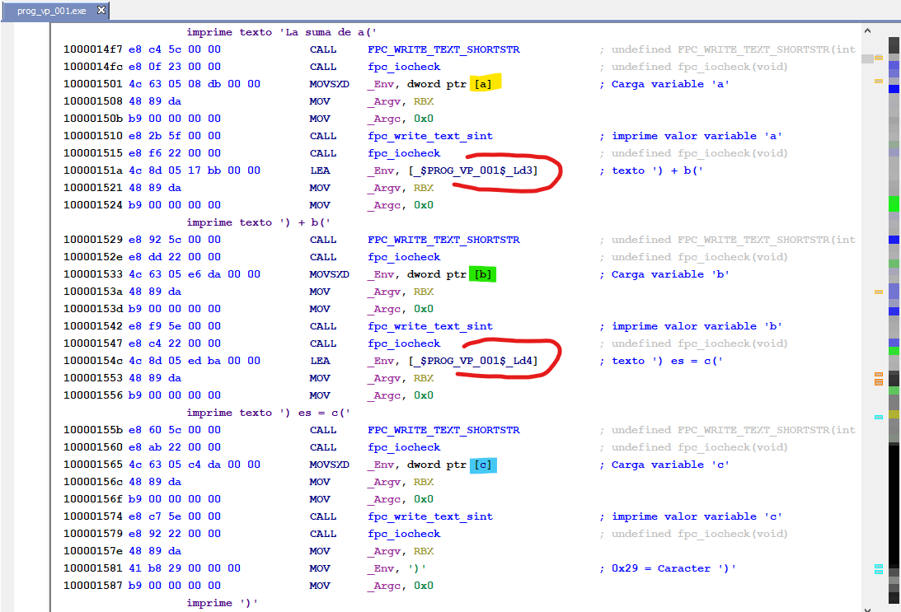

La siguiente parte del código vemos como la linea de nuestro código de **Free Pascal** representada por el siguiente texto:

	WriteLn('La suma de a(',a,') + b(',b,') es = c(',c,')'); 
	
Se prepara y se envía a pantalla en diferentes bloques:

Va alternando la impresión de los textos fijos, como **"La suma de a("** seguida de la carga de la variable **a** para mostrar su valor, y asi sucesivamente con todo el texto del mensaje a mostrar.

Finalmente cierra el dispositivo de salida a pantalla, y ejecuta la llamada a la función para finalizar el programa.

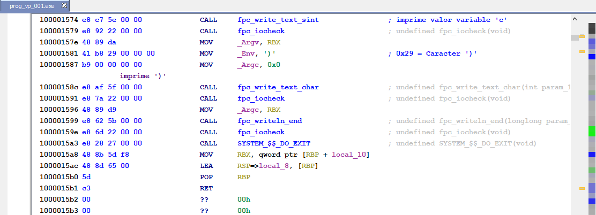

De hecho, si miramos el código descompilado en **Ghidra** no se parece mucho a nuestro código original.

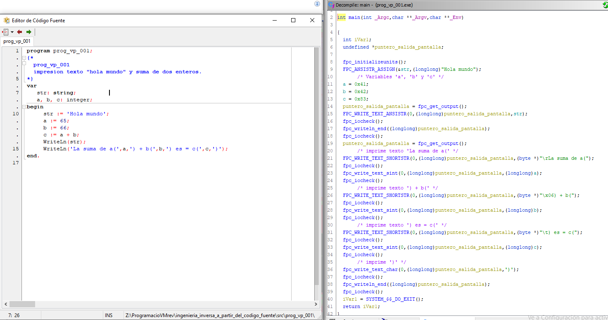

De hecho, **Ghidra** hace algunas optimizaciones, como por ejemplo, no refleja la suma de **a** + **b** sobre **c**, sino que pone directamente el resultado final sobre **c**.

Y después representa por separado las diferentes impresiones en pantalla alternando los textos constantes y las variables.

## Análisis estático con Cutter

### No Main => entry0

Al analizar el archivo con **Cutter** + **Radare2** me encuentro con algo inusual.

En la carga "*por defecto*" con el análisis normal "**aaa**" aparecen algunas instrucciones como **inválidas** y se va directamente al **entry0**. Si hago una búsqueda de **main** no aparece dicha función. 

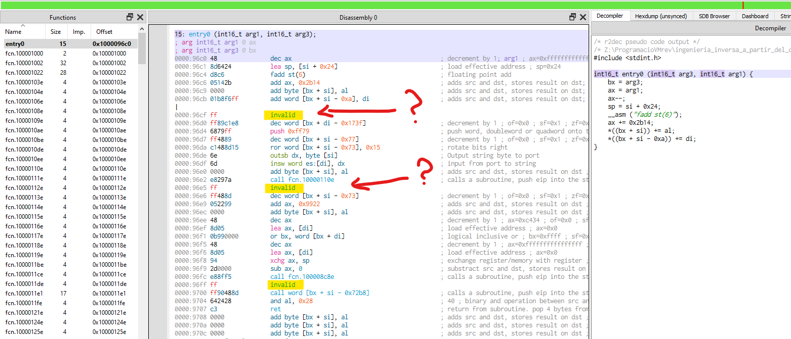

Así pues experimento con diferentes opciones en la carga. Está claro que no ha reconocido el formato del ejecutable, bien que es de Windows, o que es de 64 bits, o cualquier otra opción que ahora yo desconozco.

En la carga del binario, en **Opciones avanzadas** fuerzo opciones de CPU indicando que el Kernel des **Windos** y el formato del ejecutable es **pe64**.

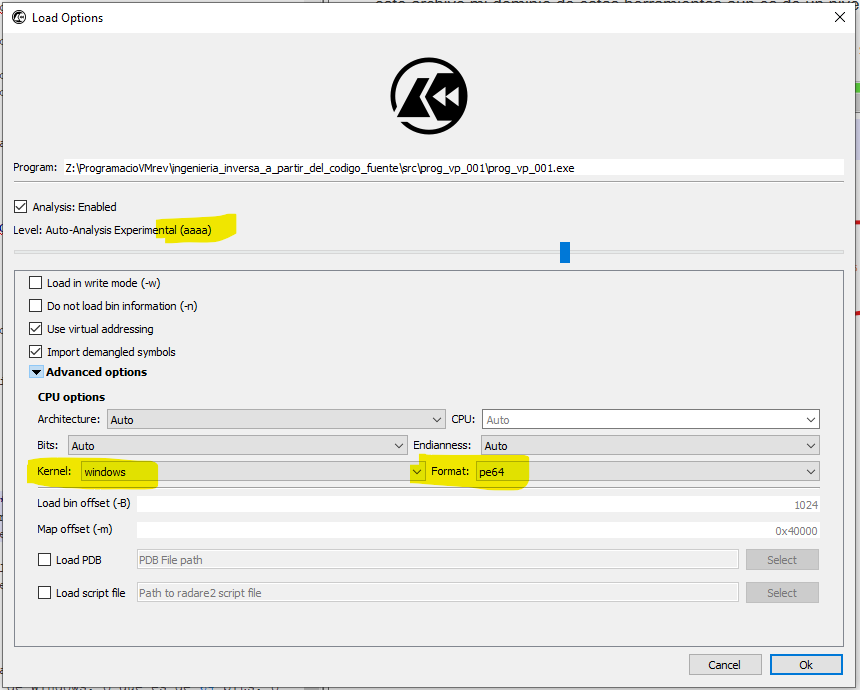

Esta vez ya muestra en **entry0** el codigo válido para 64 bits y las llamadas a la funciones. Aunque sigue sin haber una referencia a la función **main** si vamos siguiendo las llamadas a las diferentes funciones. Hago un seguimiento y entro en la llamada a la función **call fcn.100008c90**

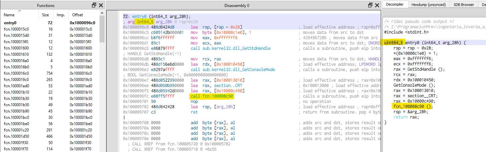

Sigo el hilo y vamos a la siguiente llamada, justo después del **lea rdx,[rdx]** que no aparece reflejado en el descompilado (error del descompilador???).

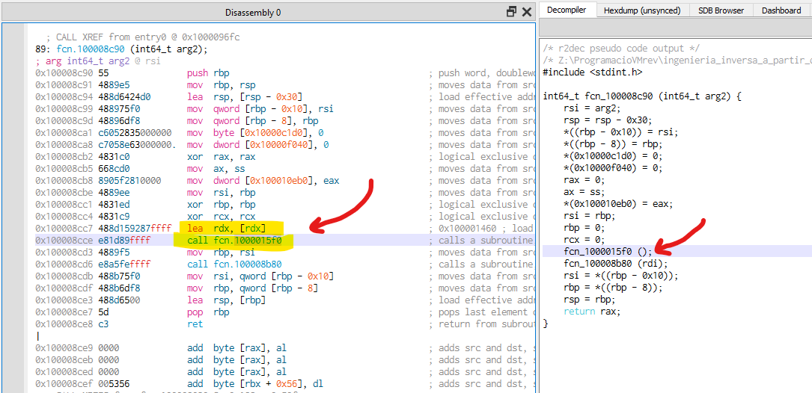

Y aquí tenemos una llamada a la dirección cargada en el registro **RDX**, donde curiosamente tenemos a la lista de funciones definidas, una con el nombre **rdx** y la dirección de memoria coincide con el **main** en el análisis hecho en **Ghidra**.

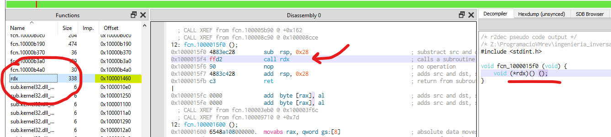

Veamos la función **rdx** que nos muestra Cutter antes de pasar a renombrar algunos simbolos y variables.

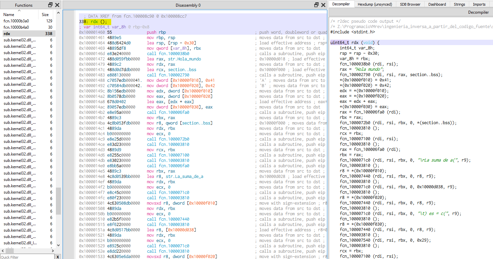

### Main

Finalmente, este sería el **main** aunque la interface no me ha permitido asignar nombres de variables a las zonas de memoria correspondientes a las variables **a**, **b** y **c**.

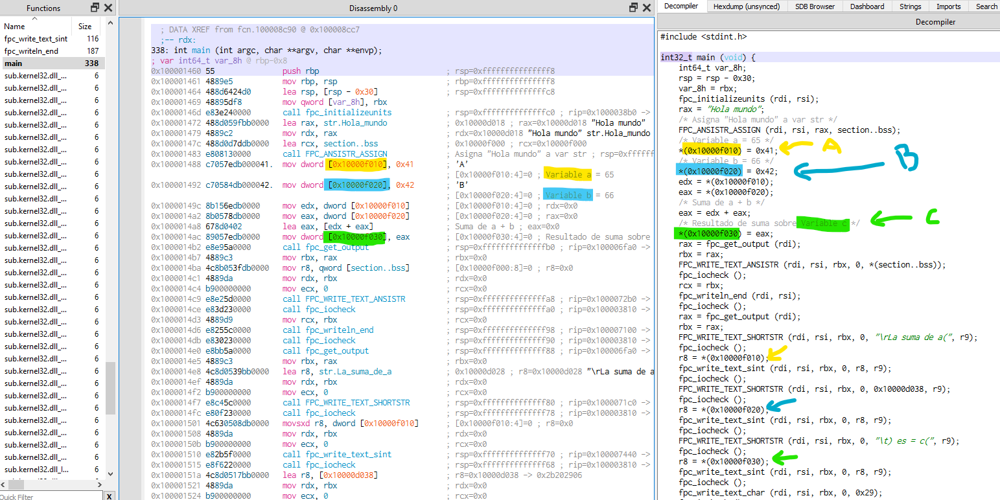

### fin prog_vp_001

[<<== **ANTERIOR** prog_c_004](../prog_c_004/prog_c_004.md)

[**SIGUIENTE** prog_vp_002 ==>>](../prog_vp_002/prog_vp_002.md)

