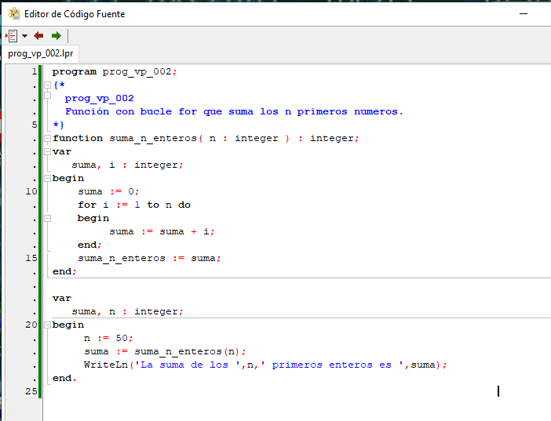

# prog_vp_002

Este programa incluye ya una llamada a una función y es la versión en **Pascal** del mismo ejemplo hecho en **C** en el [prog_c_003](../prog_c_003/prog_c_003.md).

## El programa (Código Fuente)

Tenemos una función con un bucle **for** que realiza una suma los **n** primeros números que le pasamos como parámetro. Al finalizar devuelve como resultado esta suma a la función principal del programa.

 

Y aquí vemos el resultado de la ejecución.
 

## Análisis estático con Ghidra

### Entry Point => _mainCRTStartup 

Aunque podríamos ir directamente la función **main**, en este caso voy a mostrar el punto de entrada (**entry**), cosa que no mostré en el ejemplo anterior. Podemos ver que esta función de entrada difiere de los ejemplos hechos en **C** y compilados con **MinGW** pues todo el código antes de llegar a **main** también varia dependiendo del lenguaje y compilador usados.

No obstante, el objetivo es el mismo, pues apunta a la función [**_mainCRTStartup**](https://docs.microsoft.com/es-es/cpp/build/reference/entry-entry-point-symbol?view=vs-2019) que tiene por objeto establecer el tipo de aplicación (**Consola**, **Windows GUI** o **DLL**). Esta función establece el modo consola con la llamada **__$dll$kernel32$GetConsoleMode()** y después llama a lo que es el **main** de nuestra función a través de la función **_FPC_EXE_Entry()**. 

Dentro de la función **_FPC_EXE_Entry()** se ejecuta la llamada **SYSTEM_$$_MAIN_WRAPPER$POINTER$POINTER$$INT64(0,main)** que se recibe como puntero la dirección de main y se hace la llamada a **main** de manera indirecta. 

Si entramos en **SYSTEM_$$_MAIN_WRAPPER$POINTER$POINTER$$INT64** vemos que la función únicamente hace un **CALL** a la dirección recibida como parámetro.

Y nos quedaría un grafico de llamadas como este.

### Main

Situándonos ya en la función **main()** pongo lado a lado el programa original vs el descompilado de **Ghidra** para ubicar las diferentes operaciones y ver que cambios introduce.

Se puede apreciar que la **variable n** (señalada en rojo) tiene reservado su espacio en la sección **.bss** en lugar de en la Pila como sucede en el programa compilado en **MinGW**.

Y lo mismo pasa con el resultado de la suma (señalado en amarillo), que se devuelve sobre el registro **RAX** pero despues se almacena también en su espacio reservado en la sección **.bss**.

La sección **.bss** es el espacio reservado dentro del propio programa para las variables asignadas estáticamente. Es un espacio reservado para las variables, pero que inicialmente no tienen ningún valor preestablecido.

Y los textos fijos (subrayados en azul y celeste) como **"La suma de los "** están situados en la sección **.rdata**.

Una vez identificadas las variables, valores y operaciones cotejo esto con el código en ensamblador para ver si el descompilado no omite alguna operación y ubico los diferentes bloques correspondientes a las lineas de código.

Se puede observar en la siguiente imagen que la llamada a la función **suma_n_enteros** en el descompilado tiene asignado el valor fijo **0x32** (50 dec), pero en realidad es la variable **n** que se ha cargado previamente en el registro **EAX** y después sobre el registro **ECX** que es el utilizado para pasar el parámetro (recordemos que utiliza la convención [**_fastcall**](https://docs.microsoft.com/en-us/cpp/cpp/fastcall?view=vs-2019)).

En el resto de grupos de instrucciones, podemos observar la función de Pascal **WriteLn()**, donde se ha ido escribiendo por bloques las diferentes partes del texto. 

Por un lado las agrupaciones con **LEA** **MOV** **MOV** **CALL** (señaladas en morado y celeste) corresponden a la parte de la escritura de los textos fijos. Y por otro lado las agrupaciones **MOVSXD** **MOV** **MOV** **CALL** (señaladas en rosado y verde) corresponden a la escritura de las variables **n** y **suma**.

### suma_n_enteros() 

Como en casos anteriores, aquí vemos como **Ghidra** y casi que podríamos afirmar la totalidad de descompiladores, traducen el bucle **for** en un bucle **do** **while** en este caso (con una comprobación previa asegurándose de que **n** es mayor que 0), o en otros casos en un **while**, por la sencilla razón de que al traducirse en ensamblador no se puede saber con certeza como se hizo el bucle original. De hecho la mayoría de programaciones con **while** se podrían hacer con **for** y viceversa. Son simplemente dos formas diferentes que se adaptan a la visión abstracta de cada programador. 

Al entrar dentro de la función **suma_n_enteros** vamos a fijarnos ahora, antes de analizar el código, en los registros que usa y el espacio reservado en la pila (circulo rojo en la imagen). 

+ El registro **RAX** es el que devolverá el resultado de la función.
+ El registro **ECX** es el que contiene el valor del parámetro **n**

Seguidamente tenemos una serie de espacios reservados en la Pila:

+ **RBP_local**: Un espacio para guardar el registro RBP.
+ **n_local**: Un espacio donde se guarda la variable **n** recibida como parámetro.
+ **suma_res**: Espacio de la pila donde se guarda el resultado final de la suma.
+ **suma**: Espacio de la pila correspondiente a la variable **suma**.

Esto nos dará una idea de el código, a veces extraño, que genera el compilador, pues hace operaciones que nos pueden parecer redundantes o absurdas teniendo en cuenta nuestro código original en un lenguaje de más alto nivel.

Si comparamos este código con el programa similar a este pero hecho en **C** con el compilador **MinGW**, [prog_c_003](../prog_c_003/prog_c_003.md), podemos llegar a la conclusión de que este compilador genera un código más complejo y con mas usos de recursos pues usa mas espacio en la pila y también hace mas operaciones para hacer exactamente lo mismo. 

La variable **n** se carga desde el registro **ECX** (recibida como parámetro) a su espacio en la pila local (señalado en rojo). Después se inicializa el espacio de la pila correspondiente a la variable **suma** (señalado en amarillo).

Para el bucle (señalado en naranja), tiene una doble comprobación, pues inicialmente hace una comparación para saber si **n** es menor que 1 y en ese caso salta a la salida de la función. Y luego un poco mas abajo tiene la comprobación para saber si **i** (el contador) es menor o igual que **n** y seguir al siguiente valor o terminar el bucle.

La suma (señalada en verde) tiene también varios movimientos, pues carga cada uno de los valores de las posiciones de la pila (suma, i) sobre cada registro (EDX, EAX), ejecuta la suma de los dos registros y después carga el resultado de la suma que esta en **EAX** de nuevo sobre el espacio de la pila destinado a la variable **suma**.

El resultado de la suma que devuelve la función (señalado en celeste) también tiene unos movimientos ciertamente curiosos, pues carga el resultado de la suma (en la pila) sobre el registro **EAX** que a su vez es cargado en otro espacio de la pila que he denominado **suma_res** el cual vuelve a ser cargado sobre el registro **EAX** por uq es el registro encargado de devolver el resultado de la función.

Dejo para el final la parte marcada con un asterisco (*) dibujado (señalado en rosado) que correspondería a la instrucción **i = i +1** (aunque no lo he señalado en la parte del descompilado) y como proviene de la primera comparación de **n** con 1 y seguidamente entra en la parte del bucle que se incrementa la variable **i**, y dado que el bucle empieza en 1, para evitar que se incremente la **i** antes de hacer la suma, previamente hace una resta, quedando este curioso código de resta y suma seguidos.

## Análisis estático con Cutter

### main() => rdx()

Conociendo el problema del anterior binario analizado, ya sabemos que **Cutter / radare2** no interpretan bien algunas cosas en su análisis de estos programas compilados con **Lazarus** y la función **main()** queda renombrada como **rdx** por que es precisamente llamada por un puntero cargado en este registro.

Buscamos pues la función **rdx()** y tenemos el siguiente desensamblado que evidentemente se corresponde con el de **Ghidra** pero si antes renombrar adecuadamente las posiciones de memoria y de la pila no se aprecia visualmente las operaciones efectuadas, ya que el descompilado tampoco es tan acertado como el de **Ghidra** (las comparaciones son odiosas, pero es así).

Antes de continuar renombrando las variables voy a hacer otro inciso sobre los **strings** en **Pascal** que no he comentado hasta ahora.

A diferencia del **lenguaje C** en que los strings están finalizados con el carácter **nulo** (**\0**) en Pascal el primer byte indica la longitud del string. Y si, esto tiene un problema, y es que el string tendrá una longitud máxima de 255 caracteres.

Esto no lo he mostrado en el análisis anterior pero si accedemos a la sección **.rdata** veremos que el primer byte de la dirección apuntada al string desde el código, la instrucción **lea r8, [0x10000d000]** no es un carácter, sino que contiene el valor **0x0f** (15 dec) que es precisamente la longitud de esta cadena que viene a continuación. Así que procedemos a etiquetar estos strings de la zona de datos.

Tenemos ya las funciones y variables renombradas y los diferentes bloques de operaciones ubicados, aunque como en anteriores ocasiones el panel de Descompilado no refleja el cambio de nombre de variables, ni el numero de parámetros de cada función por lo que no ayuda mucho a la compresión del código y difiere bastante del original. 

### suma_n_enteros() 

Con la funcion que suma los enteros también con las variables renombradas y marcadas con los mismos colores que he hecho con el análisis en **Ghidra** para que se pueda ubicar facilmente cada grupo de operaciones y el codigo equivalente descompilado.

Se puede apreciar que el descompilador tampoco traduce el renombrado de las etiquetas.

### fin prog_vp_002

[<<== **ANTERIOR** prog_vp_001](../prog_vp_001/prog_vp_001.md)

